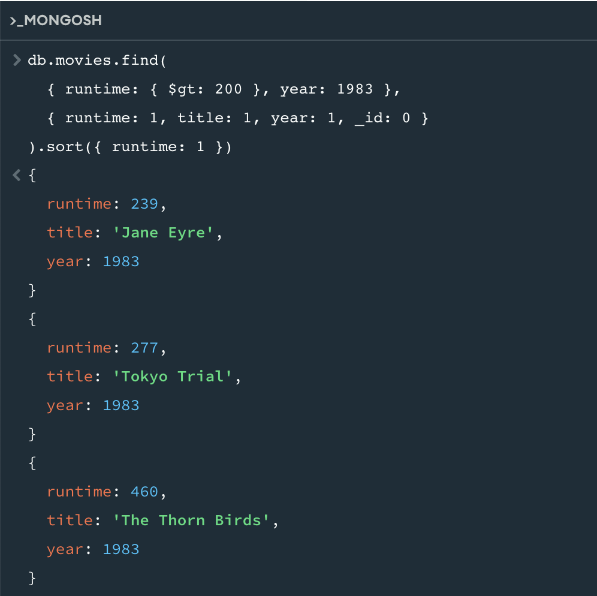
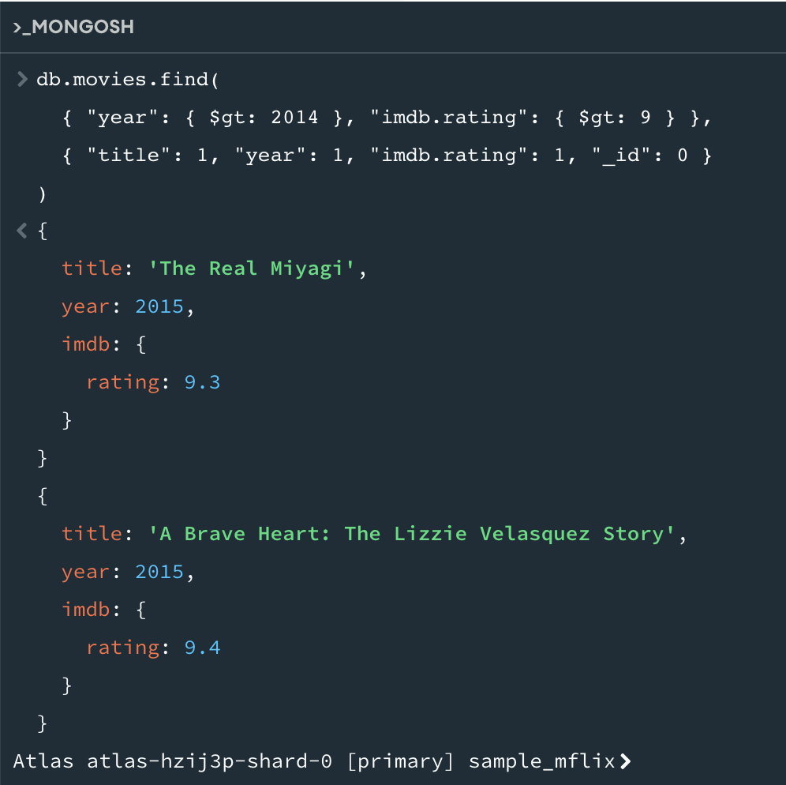

# CS3980_HW3

Query one
----------
db.movies.find(
  { runtime: { $gt: 200 }, year: 1983 },
  { runtime: 1, title: 1, year: 1, _id: 0 }
).sort({ runtime: 1 })

Query two
----------
db.movies.find(
  { "year": { $gt: 2014 }, "imdb.rating": { $gt: 9 } },
  { "title": 1, "year": 1, "imdb.rating": 1, "_id": 0 }
)

